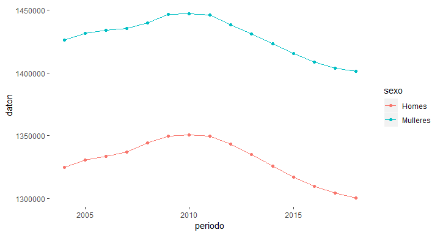

Introduction
------------

The [Galician Statistics Institute](https://www.ige.eu/web/index.jsp?idioma=es) (Instituto Galego de Estatística, IGE) is an autonomous body of the Xunta de Galicia created in 1988 and which is governed basically by Law 9/1988 on Statistics of Galicia. In its mission to promote the development of the statistical system of the Autonomous Community must provide services of collection and dissemination of available statistical documentation, develop databases of public interest, analyze the needs and evolution of the demand for statistics and ensure their dissemination.

igebaser
--------

The goal of the `igebaser` R-package is to provide a bridge between these alternatives and allow researchers to focus on their research questions and not the question of accessing the data. The igebaser R-package allows researchers to quickly search and download the data of their particular interest in a programmatic and reproducible fashion; this facilitates a seamless integration into their workflow and allows analysis to be quickly rerun on different areas of interest and with realtime access to the latest available data.

Installation
------------

You can download the released version of igebaser from Github with:

``` r
# devtools::install_github("jmcartiles/igebaser")
```

### Highlighted features of the `igebaser` R-package:

-   Access to all data available in the API
-   Support for searching and downloading data
-   Ability to return `POSIXct` dates for easy integration into plotting and time-series analysis techniques
-   Support for `grep` style searching for data descriptions and names

Getting Started
===============

The first step would be searching for the data you are interested in. `igebase_search()` provides `grep` style searching of all available indicators from the IGE API and returns the indicator information that matches your query.

Finding available data with `cache`
-----------------------------------

For performance and ease of use, a cached version of useful information is provided with the `igebaser` R-package. This data is called `cache` and provides a snapshot of available indicators, and other relevant information. `cache` is by default the the source from which `igebase_search()` and `igebase()` uses to find matching information. The structure of `cache` is as follows

``` r
library(igebaser)
str(igebaser::cache)
#> 'data.frame':    9808 obs. of  5 variables:
#>  $ tema      : chr  "Territorio, recursos naturais e medio ambiente" "Territorio, recursos naturais e medio ambiente" "Territorio, recursos naturais e medio ambiente" "Territorio, recursos naturais e medio ambiente" ...
#>  $ ID        : chr  "1651" "1948" "4578" "520" ...
#>  $ label     : chr  "Información climatolóxica por meses e estacións meteorolóxicas" "Información climatolóxica por meses e estacións meteorolóxicas" "Número de concellos segundo a súa superficie e superficie media" "Temperaturas e insolación" ...
#>  $ source    : chr  "Consellería de Medio Ambiente de Desenvolvemento Sostible. Anuario climatolóxico de Galicia. Informes climatolóxicos" "Consellería de Medio Ambiente de Desenvolvemento Sostible. Anuario climatolóxico de Galicia" "Instituto Geográfico Nacional" "INE. Anuario Estadístico de España" ...
#>  $ tipo_cache: chr  "taboas" "taboas" "taboas" "taboas" ...
```

Search available data with `igebase_search()`
---------------------------------------------

`igebase_search()` searches through the `cache` data frame to find indicators that match a search pattern. An example of the structure of this data frame is below

|      | tema                           | ID   | label                                                                                             | source                            | tipo\_cache |
|------|:-------------------------------|:-----|:--------------------------------------------------------------------------------------------------|:----------------------------------|:------------|
| 4310 | Poboación e condicións sociais | 3754 | Persoas segundo a frecuencia de asistencia a espectáculos e eventos culturais. Distribución xeral | IGE. Enquisa estrutural a fogares | taboas      |
| 4311 | Poboación e condicións sociais | 7514 | Persoas segundo a frecuencia de asistencia a espectáculos musicais (moderna, clásica, ópera...)   | IGE. Enquisa estrutural a fogares | taboas      |

By default the search is done over the `label` field and returns the `ID` and the `label`. To return all the columns of the matching rows you can set `extra = TRUE`.

``` r
library(igebaser)
busqueda <- igebase_search(pattern = "parado")
head(busqueda)
#>       ID
#> 863 7128
#> 864 7129
#> 865 7147
#> 866 7125
#> 906 8160
#> 907 8207
#>                                                                                                                     label
#> 863                                              Parados por grupos de idade e segundo o tempo de residencia no municipio
#> 864 Parados por relación entre o municipio de residencia actual e o anterior e segundo o tempo de residencia no municipio
#> 865                                               Parados por sexo, lugar de nacemento e tempo de residencia no municipio
#> 866                                          Parados por sexo, nacionalidade e segundo o tempo de residencia no municipio
#> 906                                   Parados por sector do nivel de formación alcanzado, sexo e grupos de idade. Galicia
#> 907                                 Parados por situación anterior á búsqueda de emprego, sexo e grupos de idade. Galicia
```

Other fields can be searched by simply changing the `fields` parameter. For example

``` r
library(igebaser)
padron_busqueda <- igebase_search(pattern = "INE. Padrón continuo", fields = "source", extra = TRUE)
head(padron_busqueda)
#>         tema   ID
#> 6358 Síntese 6057
#> 6364 Síntese 6004
#>                                                                                                     label
#> 6358                                                Indicadores de poboación. Datos por seccións censuais
#> 6364 Poboación segundo relación entre o lugar de nacemento e o de residencia. Datos por seccións censuais
#>                                                   source tipo_cache
#> 6358 IGE. Indicadores demográficos; INE. Padrón continuo     taboas
#> 6364                                INE. Padrón continuo     taboas
```

Regular expressions are also supported.

``` r
library(igebaser)
# 'pobreza' OR 'parados' OR 'trabajador'
popatr_busqueda <- igebase_search(pattern = "pobreza|parados|trabajador", extra = TRUE)
head(popatr_busqueda)
#>                               tema   ID
#> 863 Poboación e condicións sociais 7128
#> 864 Poboación e condicións sociais 7129
#> 865 Poboación e condicións sociais 7147
#> 866 Poboación e condicións sociais 7125
#> 906 Poboación e condicións sociais 8160
#> 907 Poboación e condicións sociais 8207
#>                                                                                                                     label
#> 863                                              Parados por grupos de idade e segundo o tempo de residencia no municipio
#> 864 Parados por relación entre o municipio de residencia actual e o anterior e segundo o tempo de residencia no municipio
#> 865                                               Parados por sexo, lugar de nacemento e tempo de residencia no municipio
#> 866                                          Parados por sexo, nacionalidade e segundo o tempo de residencia no municipio
#> 906                                   Parados por sector do nivel de formación alcanzado, sexo e grupos de idade. Galicia
#> 907                                 Parados por situación anterior á búsqueda de emprego, sexo e grupos de idade. Galicia
#>                                   source tipo_cache
#> 863 IGE-INE. Enquisa de poboación activa     taboas
#> 864 IGE-INE. Enquisa de poboación activa     taboas
#> 865 IGE-INE. Enquisa de poboación activa     taboas
#> 866 IGE-INE. Enquisa de poboación activa     taboas
#> 906 IGE-INE. Enquisa de Poboación Activa     taboas
#> 907 IGE-INE. Enquisa de Poboación Activa     taboas
```

Downloading data with `igebase()`
---------------------------------

Once you have found the set of indicators that you would like to explore further, the next step is downloading the data with `igebase()`. The following examples are meant to highlight the different ways in which `igebase()` can be used and demonstrate the major optional parameters.

``` r
library(igebaser)
padron_data <- igebase(igebase_ID = 589)
head(padron_data)
#>    sexo codtempo tempo codespazo         espazo   daton     datot
#> 1 Total     2004  2004        12     12 Galicia 2750985 2.750.985
#> 2 Total     2004  2004        15    15 A Coruña 1121344 1.121.344
#> 3 Total     2004  2004     15001 15001 Abegondo    5732     5.732
#> 4 Total     2004  2004     15002     15002 Ames   20840    20.840
#> 5 Total     2004  2004     15003   15003 Aranga    2274     2.274
#> 6 Total     2004  2004     15004     15004 Ares    5265     5.265
```

If you are interested in only some subset of regions you can pass along the specific region to the `region` parameter.

``` r
library(igebaser)
padron_data_galicia <- igebase(igebase_ID = 589, region = "Galicia")
head(padron_data_galicia)
#>          sexo codtempo tempo codespazo     espazo   daton     datot
#> 1       Total     2004  2004        12 12 Galicia 2750985 2.750.985
#> 376     Homes     2004  2004        12 12 Galicia 1324987 1.324.987
#> 751  Mulleres     2004  2004        12 12 Galicia 1425998 1.425.998
#> 1126    Total     2005  2005        12 12 Galicia 2762198 2.762.198
#> 1501    Homes     2005  2005        12 12 Galicia 1330703 1.330.703
#> 1876 Mulleres     2005  2005        12 12 Galicia 1431495 1.431.495
```

### Using `POSIXct = TRUE`

The default format for the `tempo` column is not conducive to sorting or plotting, especially when downloading sub annual data, such as monthly or quarterly data. To address this, if `TRUE`, the `POSIXct` parameter adds the additional columns `periodo` and `periodicidade`. `periodo` converts the default date into a `POSIXct`. `periodicidade` denotes the time resolution that the date represents. If `POSIXct = TRUE` is not available, a `warning` is produced and the option is ignored.

`startdate` and `enddate` must be in the format `yyyy-mm-dd`.

``` r
library(igebaser)
padron_data_galicia <- igebase(igebase_ID = 589, region = "Galicia", POSIXct = TRUE, startdate = "2000-01-01", enddate = "2018-12-01")
head(padron_data_galicia)
#>          sexo codtempo tempo codespazo     espazo   daton     datot
#> 1       Total     2004  2004        12 12 Galicia 2750985 2.750.985
#> 376     Homes     2004  2004        12 12 Galicia 1324987 1.324.987
#> 751  Mulleres     2004  2004        12 12 Galicia 1425998 1.425.998
#> 1126    Total     2005  2005        12 12 Galicia 2762198 2.762.198
#> 1501    Homes     2005  2005        12 12 Galicia 1330703 1.330.703
#> 1876 Mulleres     2005  2005        12 12 Galicia 1431495 1.431.495
#>         periodo periodicidade
#> 1    2004-01-01         anual
#> 376  2004-01-01         anual
#> 751  2004-01-01         anual
#> 1126 2005-01-01         anual
#> 1501 2005-01-01         anual
#> 1876 2005-01-01         anual
```

The `POSIXct = TRUE` option makes plotting and sorting dates much easier.

``` r
library(igebaser)
library(ggplot2)
#> Warning: package 'ggplot2' was built under R version 3.5.2
library(dplyr)
#> 
#> Attaching package: 'dplyr'
#> The following objects are masked from 'package:stats':
#> 
#>     filter, lag
#> The following objects are masked from 'package:base':
#> 
#>     intersect, setdiff, setequal, union
padron_data_galicia <- igebase(igebase_ID = 589, region = "Galicia", POSIXct = TRUE, startdate = "2000-01-01", enddate = "2018-12-01") %>%
  filter(sexo != "Total")
ggplot(padron_data_galicia, aes(x = periodo, y = daton, color = sexo)) +
  geom_line() +
  geom_point() +
  theme(panel.background = element_blank())
```



### Using `freq`

If the data has several granularity, you can select some of them with the parameter `freq`. Possible values are: `anual`,`trimestral`,`mensual`.

``` r
library(igebaser)
clima_data <- igebase(1651, POSIXct = TRUE, label = TRUE, freq = "anual", show_metadata = TRUE)
#> "label" : "Información climatolóxica por meses e estacións meteorolóxicas",
#> "source" : "Consellería de Medio Ambiente de Desenvolvemento Sostible. Anuario climatolóxico de Galicia. Informes climatolóxicos",
#> "updated" : "2007-12-19 13:18:40.0",
head(clima_data)
#>                                              estación.meteorolóxica
#> 1                                           CIS Ferrol - A (Ferrol)
#> 2  Santiago (Observatorio Astronómico) - A (Santiago de Compostela)
#> 3                                            Campus Lugo - A (Lugo)
#> 4                                    Ourense-Ciencias - A (Ourense)
#> 5                                         Lourizán - A (Pontevedra)
#> 66                                          CIS Ferrol - A (Ferrol)
#>    codtempo tempo variable.climatolóxica daton datot
#> 1      2001  2001 Temperatura media (ºC)  14.4  14,4
#> 2      2001  2001 Temperatura media (ºC)    NA     -
#> 3      2001  2001 Temperatura media (ºC)  12.2  12,2
#> 4      2001  2001 Temperatura media (ºC)    NA     -
#> 5      2001  2001 Temperatura media (ºC)  14.4  14,4
#> 66     2002  2002 Temperatura media (ºC)  14.3  14,3
#>                                                             table
#> 1  Información climatolóxica por meses e estacións meteorolóxicas
#> 2  Información climatolóxica por meses e estacións meteorolóxicas
#> 3  Información climatolóxica por meses e estacións meteorolóxicas
#> 4  Información climatolóxica por meses e estacións meteorolóxicas
#> 5  Información climatolóxica por meses e estacións meteorolóxicas
#> 66 Información climatolóxica por meses e estacións meteorolóxicas
#>       periodo periodicidade
#> 1  2001-01-01         anual
#> 2  2001-01-01         anual
#> 3  2001-01-01         anual
#> 4  2001-01-01         anual
#> 5  2001-01-01         anual
#> 66 2002-01-01         anual
```
